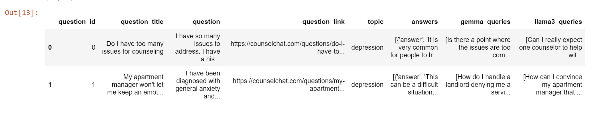
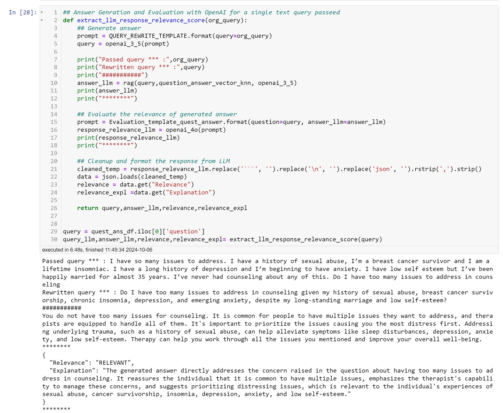
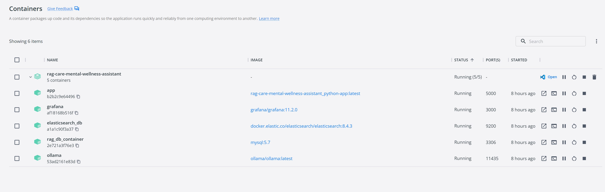
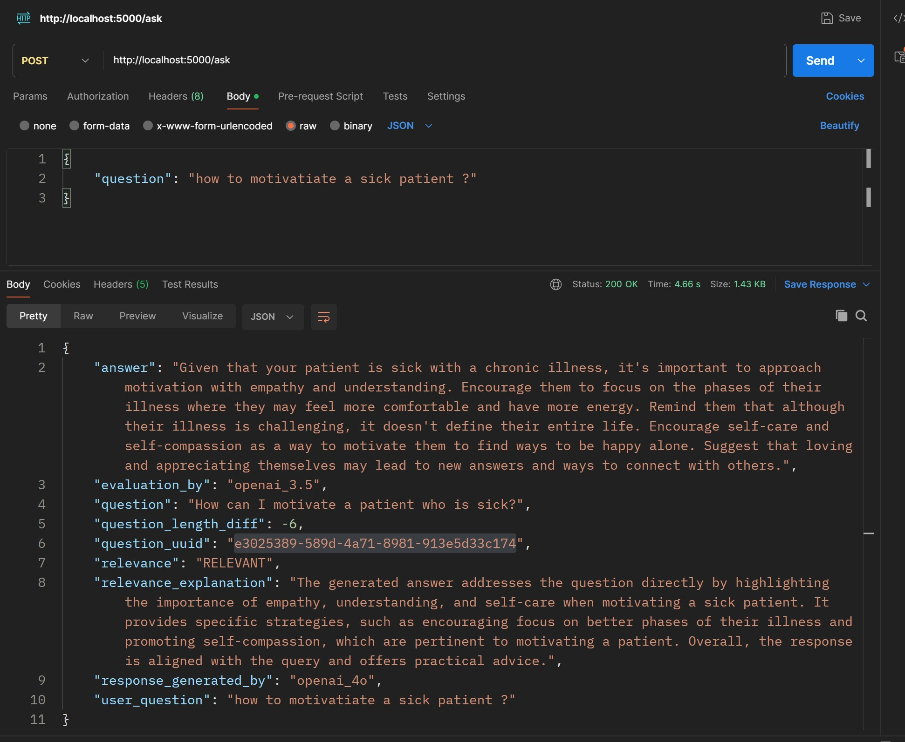
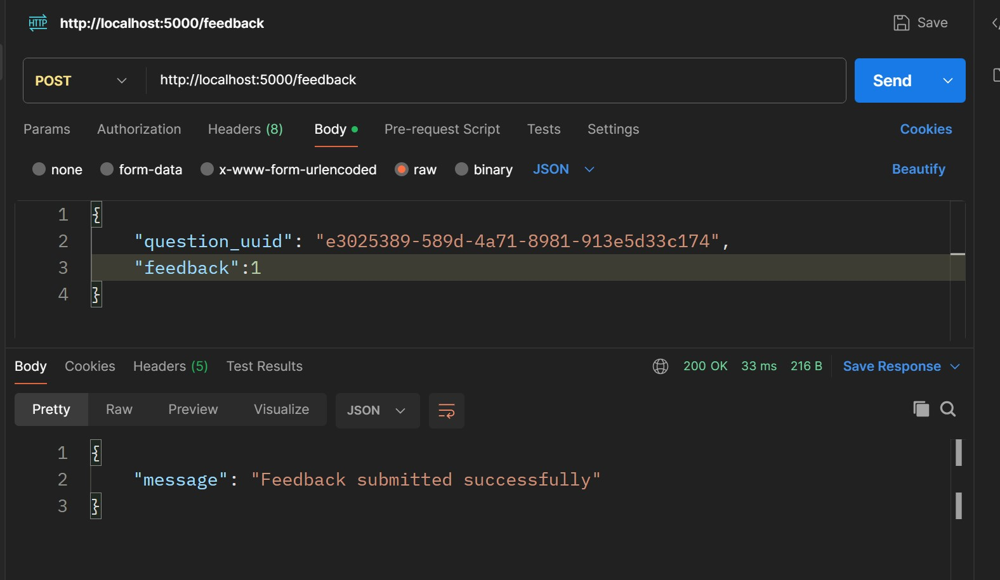
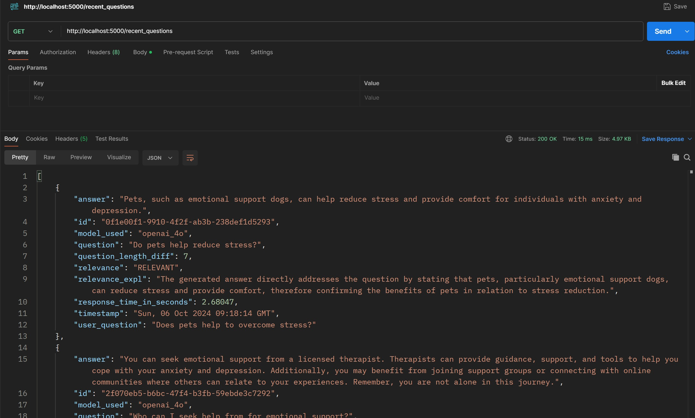
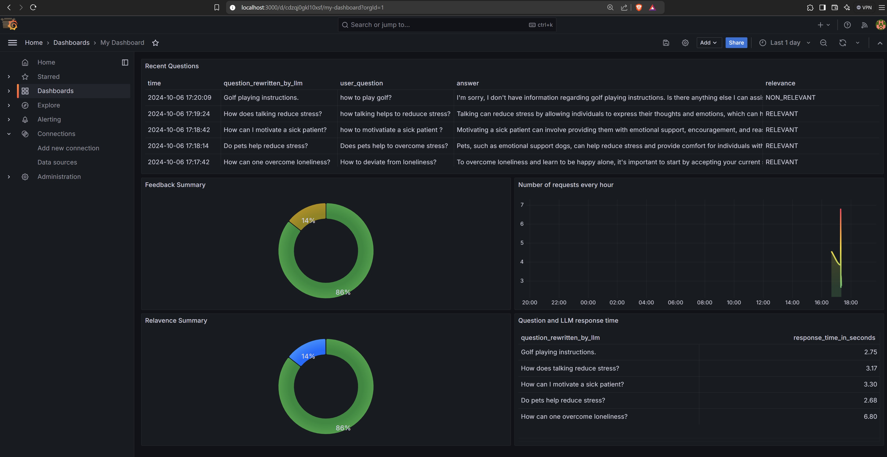
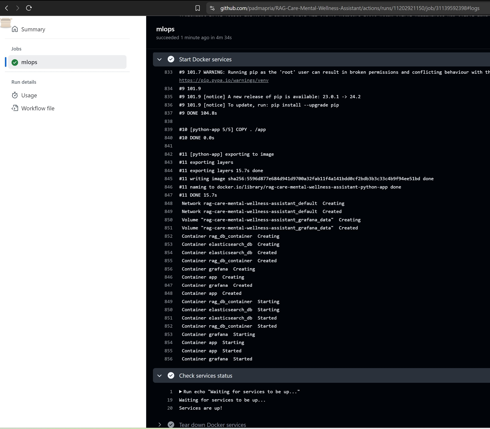
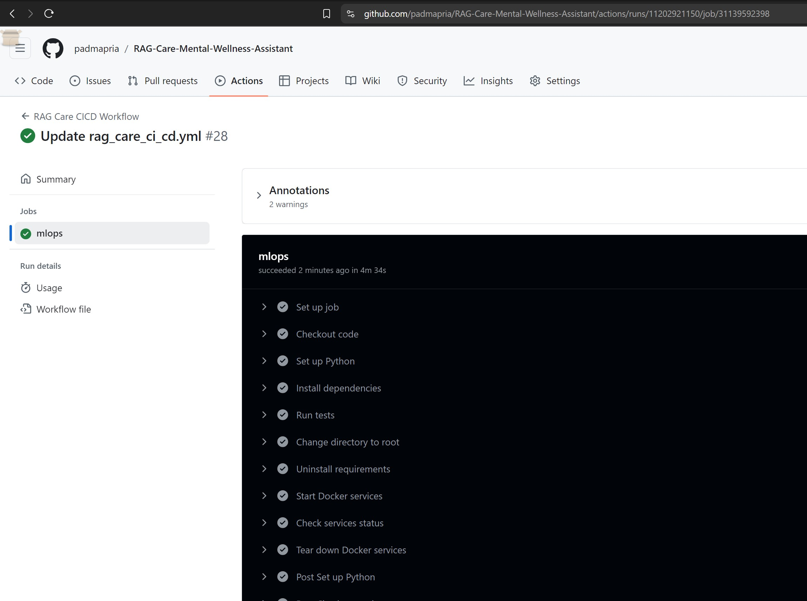

## RAG-Care-Mental-Wellness-Assistant

### Table of Contents
- [Project Overview](#project-overview)
- [Problem Description](#problem-description)
- [Technologies](#technologies)
- [Knowledge Base](#knowledge-base)
- [Ground Truth Generation and Evaluation](#ground-truth-generation-and-evaluation)
- [Ingestion Pipeline](#ingestion-pipeline)
- [Retrieval Evaluation](#retrieval-evaluation)
- [User query rewriting ](#user-query-rewriting )
- [RAG Evaluation](#rag-evaluation)
- [Containerization](#containerization)
- [FlaskAPI](#flaskapi)
- [User Data Collection and Monitoring](#user-data-collection-and-monitoring)
- [CICD Pipeline](#cicd-pipeline)
- [Setup Instructions](#setup-instructions)
- [Usage](#usage)

### Project Overview
The **RAG-Care-Mental-Wellness-Assistant** project aims to develop a conversational AI system that provides accessible mental wellness support. By leveraging Retrieval-Augmented Generation (RAG) technology, the assistant allows users to interact with trusted mental health resources effectively.

## Problem Description
Traditional methods of retrieving mental health information can be time-consuming and inefficient. This project addresses the challenge of navigating complex mental health resources by providing fast, personalized, and accurate responses to users' mental health-related queries.

### Technologies
- **Python**: Core programming language.
- **Hugging Face Transformers**: For language model integration.
- **LLaMA Models (LLaMA3:8b & Gemma2:2b)**: For ground truth query generation and evaluation.
- **LLaMA Models (Gemma2 & OpenAI3.5 and OpenAI4o)**: For RAG Flow evaluation and 
- **Pydantic**: Data modeling and validation.
- **Pandas**: Data manipulation and analysis.
-  **ElasticSearch**: Vectorstore
- **Flask**: Web application framework.
- **MySQL**: Data storage of user interaction
- **Grafana**: Dashboard
- **Docker**: For containerization and environment management.
- **CI/CD**: Unit/Integration test, GitHub Actions, and CD via AWS.

---

## Section 1: Dataset and Ground Truth Generation  <br/>
(Notebook is in the folder `/notebooks/step0_data_preparation.ipynb`)  <br/>
[Data Preparation Notebook: Step 0](https://github.com/padmapria/RAG-Care-Mental-Wellness-Assistant/blob/master/notebooks/step0_data_preparation.ipynb)
 
### Knowledge Base
- **Counsel Chat Dataset**: A comprehensive dataset of mental health-related conversations.
- **Source**: Utilizes the [Counsel Chat Dataset](https://huggingface.co/datasets/nbertagnolli/counsel-chat) from Hugging Face.
- **Focus**: Data related to **depression**.
- **Processing**: Only questions with depression as the topic and titles longer than 20 characters are included.


### Ground Truth Generation and Evaluation
- **LLaMA3** and **Gemma2 models** are utilized for generating high-quality ground truth data, ensuring that the response is accurate and relevant to mental wellness queries on depression.
- Ground truth data is evaluated before testing with RAG. **LLaMA3** evaluates the quality of queries generated by **Gemma2**, and vice versa, to ensure robustness and relavence of the query.

---

## Section 2: RAG Flow and Evaluation   <br/>
(Notebook in the folder `/notebooks/step1_data_preparation.ipynb`) <br/>
[RAG Test Notebook: Step 1](https://github.com/padmapria/RAG-Care-Mental-Wellness-Assistant/blob/master/notebooks/step1_rag_test.ipynb)

Integrates the Counsel Chat Dataset knowledge base and **LLaMA3:8b, OpenAI API, Gemma2:2b models** 

### Ingestion Pipeline
- Semi-automated ingestion pipeline via **Jupyter Notebook (step0)** for data ingestion and preparation

### Indexing and Storing the data
 **VectorStore**: The project integrates **Elasticsearch** to index and retrieve mental health-related data, enabling efficient vector similarity searches for question-answer pairs.
 
### Retrieval Evaluation
The system evaluates retrieval performance using:
- `minsearch_search` (text search)
- `question_answer_vector_knn` (vector search)
- `question_answer_vector_knn_combined` (vector + text search)

<b> Evaluation Metrics </b>
- **Hit Rate**: Measures the proportion of relevant documents retrieved.
- **Mean Reciprocal Rank (MRR)**: Assesses the ranking quality of retrieved documents.

### User query rewriting 
- The user queries are rewritten with openAI 3.5 turbo API
  
### RAG Evaluation
- The RAG flow is evaluated using **Gemma2** and **OpenAI** as LLM judges for:
- Relvevence of LLM generated answer against true answer
- Relvevence of LLM generated answer against the question
 
---

## Section 3: Interface  <br/>
### Containerization
- The entire system is containerized using **Docker** and managed via **docker-compose** to ensure ease of deployment.
- The **docker-compose.yml** file is present in the root directory of the project. It defines services for:
  - **ElasticSearch**: For indexing and searching the mental health-related data.
    - The **vectorstore index** are created during the container initialization.
  - **Grafana**: For monitoring and analytics, with a pre-configured dashboard.
    - The **Grafana JSON** file is automatically uploaded during container initialization for immediate use.
  - **Python**: For running the Flask application and RAG logic.
  - **MySQL**: For user interaction data management.
     - The **SQL Tables** are created during the container initialization.
    
        
  <br/>
- The Docker setup also includes **unit and integration tests** to ensure the functionality and stability of the system:
  - **Unit tests**: For verifying individual components of the system.
  - **Integration tests**: For testing the interaction between different components (e.g., Flask, ElasticSearch, etc.).
  - Tests are automatically triggered during the CI/CD pipeline.
   
---

### FlaskAPI
*(Source code in the folder `/services/app`)*  
[app](https://github.com/padmapria/RAG-Care-Mental-Wellness-Assistant/blob/master/services/app)
- A web application built with **Flask**.
- The application provides the following functionalities:
  - **Query Processing**: Accepts user queries and rewrites them to optimize search results.
  - **Vector Store Search**: Searches the vector store to retrieve relevant answers.
  - **LLM Integration**: Utilizes two Large Language Models (LLMs):
    - **Generator LLM**: Retrieves answers from the vector store.
    - **Evaluator LLM**: Calculates the effectiveness of the retrieved answer and provides relevance explanations using OpenAI LLM.
      - Endpoint: `http://localhost:5000/ask`
         <br/>
        
  - **Feedback Processing**: Accepts feedback for every query.
      - Endpoint: `http://localhost:5000/feedback`
         <br/>
        
  - **Listing Recent Questions**: Shows the last 5 questions from the user.
      - Endpoint: `http://localhost:5000/recent_questions`
         <br/>
    
---

### User Data Collection and Monitoring
*(Init.sql configuration is located in the folder `/services/app/mysql`)*  
[mysql](https://github.com/padmapria/RAG-Care-Mental-Wellness-Assistant/blob/master/services/mysql) 
- **User Feedback Collection**: Tracks user interaction and feedback with MySQL.
    - MySQL Access: `http://localhost:3306`
      <br/>
- **Monitoring Dashboard**: Provides insights into system performance and user activity.
  - *(Dashboard.json configuration is located in the folder `/services/app/grafana`)*
  - [grafana](https://github.com/padmapria/RAG-Care-Mental-Wellness-Assistant/blob/master/services/grafana) 
- The application also integrates **Grafana**, a monitoring and visualization tool. Grafana allows users to track performance metrics of the RAG model and the underlying infrastructure, ensuring that the application operates efficiently.
  - Grafana dashboard can be accessed from:
    - `http://localhost:3000`
       <br/>
    
---

## Section 4: Testing and Cloud Deployment  <br/>
- **Testing**: Unit and integration test cases are located in the `/services/app/tests` [tests](https://github.com/padmapria/RAG-Care-Mental-Wellness-Assistant/blob/master/services/app/tests) directory. These tests ensure the functionality and reliability of the application.

#### GitHub Actions Workflow
The following GitHub Actions workflow is defined in the `.github/workflows/ci-cd.yml` file: [GitHub Actions Workflow: CI/CD Pipeline](https://github.com/padmapria/RAG-Care-Mental-Wellness-Assistant/blob/master/.github/workflows/rag_care_ci_cd.yml)
- Every GitHub push triggers the CI/CD pipeline.

### CICD Pipeline

Our project utilizes a robust CI/CD pipeline to ensure continuous integration and deployment. This process is managed using **GitHub Actions** and is triggered by every push to the `master` branch as well as pull requests targeting the `master` branch.


##### Steps

1. **Triggering the Pipeline**: 
   - The CI/CD pipeline is initiated on every push or pull request to the `master` branch to ensure that all changes are validated before merging.

2. **Checkout Code**: 
   - The pipeline checks out the latest code from the repository, allowing access to the current version for the workflow.

3. **Set Up Python Environment**: 
   - A Python environment is set up using the specified version (e.g., `3.8`) to ensure compatibility with the project.

4. **Install Dependencies**: 
   - All required Python packages are installed using the `requirements.txt` file, ensuring that the necessary dependencies are available for the application.

5. **Run Tests**: 
   - The pipeline runs unit and integration tests located in the `/services/app/tests` directory. This validates the functionality and reliability of the application.

6. **Change Directory Back to Root**: 
   - The workflow changes back to the root directory to prepare for subsequent Docker operations.

7. **Uninstall Requirements**: 
   - Dependencies are uninstalled to maintain a clean environment, preventing conflicts in future builds.

8. **Start Docker Services**: 
   - The pipeline starts the Docker services defined in the `docker-compose.yml` file, which includes the application, MySQL, ElasticSearch, and Grafana.

9. **Check Services Status**: 
   - The workflow checks if the services are up and running. It waits for a maximum of 10 attempts (with a 5-second interval) to confirm the services are operational.

10. **Tear Down Docker Services**: 
    - After the tests are completed, the workflow tears down the Docker services to free up resources.

11. **Log in to AWS ECR**: 
    - The pipeline logs into Amazon Elastic Container Registry (ECR) using AWS CLI, allowing the subsequent push of the Docker image.

12. **Build Docker Image**: 
    - A Docker image for the application is built, containing the latest code and dependencies.

13. **Tag and Push Docker Image to ECR**: 
    - The newly built Docker image is tagged with the ECR registry URL and pushed to ECR for deployment.

14. **Deploy to AWS ECS**: 
    - Finally, the updated application is deployed to AWS Elastic Container Service (ECS), ensuring the latest version is running in the cloud.

This automated CI/CD pipeline enhances the reliability and speed of our development process by continuously integrating and deploying code changes.


---

## Setup Instructions
**LLM Setup**:  <br/>
**Note:** OpenAI immediately revokes the API key once it detects that the key has been exposed publicly. Therefore, do not expose your API key.<br/>
Generate your OpenAI API key here: [Click Here](https://platform.openai.com/account/api-keys)

**Note:** Download the LLaMA 3 model (8B) and gemma2:2b from the ollama website and Install the OLLAMA server by following the instructions <br/>
https://ollama.com/blog/llama3 <br/>
https://ollama.com/blog/gemma2 <br/>


<b> Starting the ollama: </b> <br/>
Start the OLLAMA server by running the command 'ollama serve' in your terminal <br/>
By default ollama server runs in the port (11434)<br/>

<b> Steps to run the project: </b> <br/>
1. Clone this git repository from command prompt<br/>
git clone https://github.com/padmapria/RAG-Care-Mental-Wellness-Assistant.git    
cd RAG-Care-Mental-Wellness-Assistant  

2. Create a `.env` file inside the 'app' folder and in the notebooks folder store the key as follows:     
OPENAI_API_KEY=YOUR_API_KEY_HERE<br/>

3. Use Anaconda to create a conda environment and install the requirements.txt by running the following command to run the Jupyter notebooks in the notebooks folder:
```
pip install -r requirements.txt
```
 Run **Jupyter Notebook (notebooks folder)** for data ingestion and processing, RAG evaluation

4. Install Docker Desktop and use the below command to start the end-to-end Flask-based RAG application
```
docker compose up -d
```
---

### Usage
1. Access the Flask API application at [http://localhost:5000](http://localhost:5000) via Postman.
2. Input mental wellness-related queries.
3. Receive personalized guidance and support from trusted mental health resources.

---


